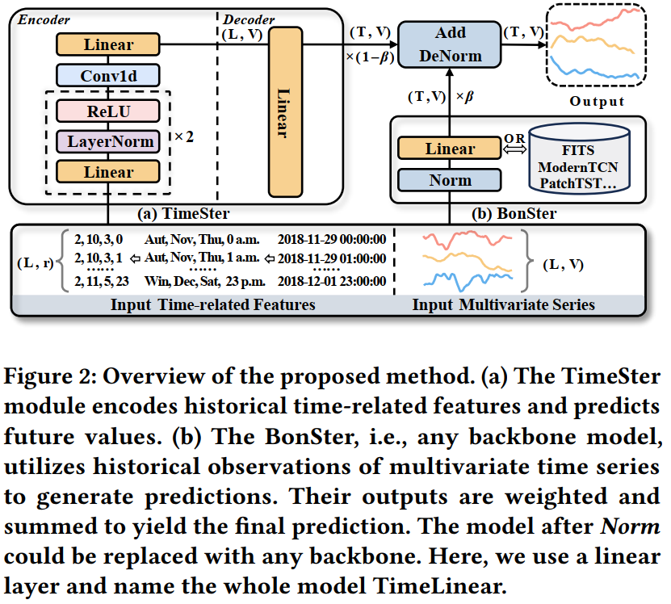
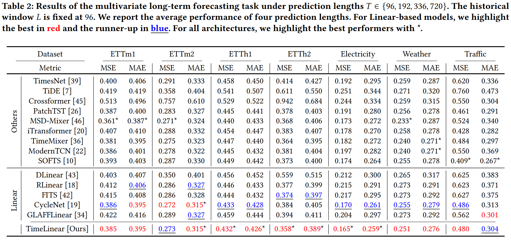

# How Much Can Time-related Features Enhance Time Series Forecasting?

In this repository, we present the code of "How Much Can Time-related Features Enhance Time Series Forecasting?".




## Data

All the datasets are available at [Autoformer: Google Drive](https://drive.google.com/drive/folders/1ZOYpTUa82_jCcxIdTmyr0LXQfvaM9vIy). You only need to download `electricity`, `ETT-small`, `traffic`, and `weather`.

## Environment

We implement our code in `Python 3.9` and `CUDA 11.7`. See [requirments.txt](./requirements.txt) for other packages. For convenience, you can install using the following commands:
```
conda create -n timelinear python=3.9

pip install https://download.pytorch.org/whl/cu117_pypi_cudnn/torch-2.0.0%2Bcu117.with.pypi.cudnn-cp39-cp39-linux_x86_64.whl

pip install -r requirements.txt
```

## Reproducibility

All the training scripts are provided in [scripts/long_term_forecast](./scripts/long_term_forecast). For instance, if you want to get the results for the `weather` dataset, you just need to run:
```
bash ./scripts/long_term_forecast/Weather_script/TimeLinear.sh
``` 
The default `seq_len` in this repository is `96`. For other experimental settings, the hyperparameters that you can tune are:
```
--seq_len
--pred_len
--batch_size
--learning_rate
--time_feature_types    # add your time-related features, e.g., HourOfDay DayOfWeek
--rda                   # reduction rate for the first hidden layer of TimeSter
--rdb                   # reduction rate for the second hidden layer of TimeSter
--ksize                 # kernel size for the Cov1d in TimeSter
--beta                  # trade-off coefficient for the output of TimeSter and BonSter (the backbone results)
```
It is recommended to tune `rda` in {8, 4, 2, 1}, `rdb` in {1, 2}, `ksize` in {3, 5, 7}, and `beta` in {0.1, ..., 0.9}.

We also provide the experimental scripts for Table 3, 4 and 5, where we combine TimeSter with state-of-the-art models. You can run the following command to reproduce the results:

```
bash ./scripts/long_term_forecast/ECL_script/TimePatchTST.sh
```

All models named `Timexx` (except for `TimesNet`) indicate we combine TimeSter with the backbone, e.g., `TimePatchTST`.

For convenience, you can also run the following command to reproduce all the results in Table 2:
```
bash ./all.sh
```

## Results

- Checkpoints for each model will be saved in `checkpoints/`;
- Training log will be saved in `log/`;
- Prediction for the testing set will be saved in `results/` (if needed) and `result_long_term_forecast`;
- Visualization for the results of testing set will be saved in `test_results/` (if `with_curve` is enabled).

Our results have been stored in `result_long_term_forecast` and `results/TimeLinear`.

## Acknowledgement

We are grateful for the following github repositories that provide valuable datasets and code base:

https://github.com/thuml/Autoformer

https://github.com/thuml/Time-Series-Library

https://github.com/yuqinie98/PatchTST

https://github.com/VEWOXIC/FITS

https://github.com/kwuking/TimeMixer

https://github.com/luodhhh/ModernTCN

https://github.com/ForestsKing/GLAFF

https://github.com/ACAT-SCUT/CycleNet

https://github.com/ts-kim/RevIN
